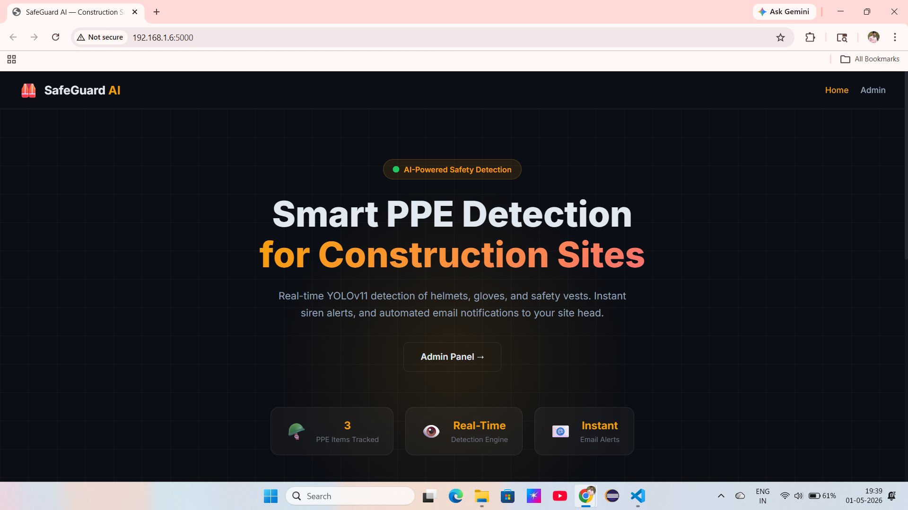
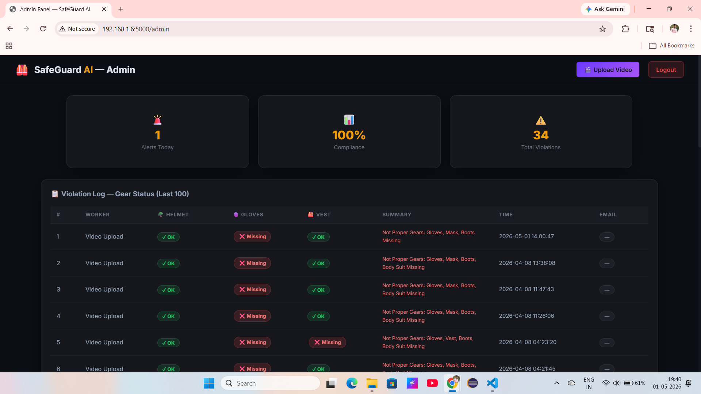
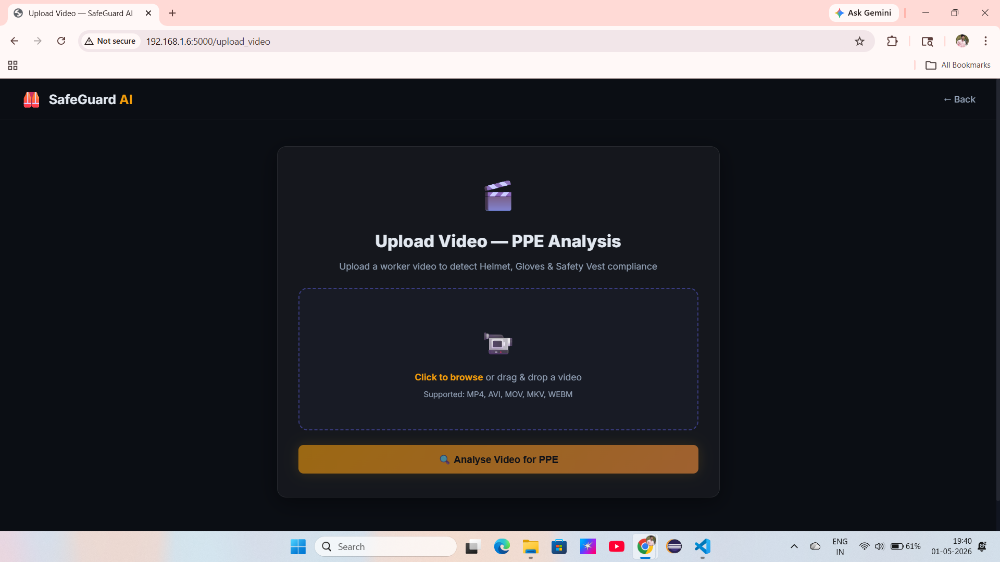
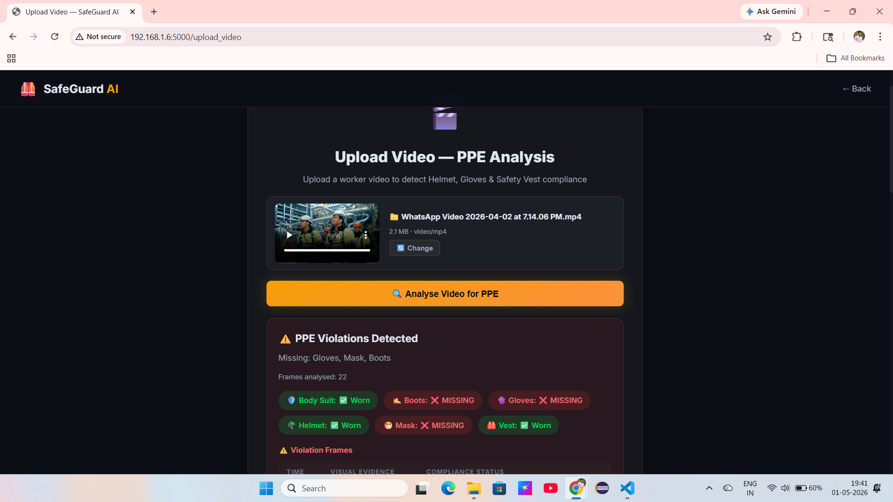

🛡️ SafeGuard AI – Smart PPE Detection System

🚧 AI-Powered Safety Monitoring for Industrial & Construction Sites

📌 Project Overview

SafeGuard AI is an intelligent safety monitoring system that uses Computer Vision and Deep Learning to detect whether workers are wearing proper Personal Protective Equipment (PPE) such as helmets, gloves, and safety vests.

The system processes real-time video streams or uploaded videos, detects violations, triggers alerts, and logs results for analysis.

🎯 Key Objectives
Automate PPE compliance monitoring
Detect helmets, gloves, and safety vests in real-time
Reduce human error in safety supervision
Generate instant alerts for violations
Maintain violation logs for analysis
✨ Features
🎥 Real-time detection using YOLO
📂 Video upload PPE analysis
🚨 Siren alert system
📧 Email notifications
📊 Admin dashboard with analytics
📁 Violation logs & history tracking
🌐 Flask-based web application

## 🖥️ System Screenshots
### 🏠 Home Page

### 📊 Admin Dashboard

### 📂 Upload Page

### ⚠️ Detection Result

⚙️ Tech Stack
🔹 Backend
Python
Flask
🔹 AI / ML
YOLO (Object Detection)
OpenCV
NumPy
🔹 Frontend
HTML, CSS, JavaScript
🔹 Database
SQLite
🧠 System Workflow
Capture video (live or uploaded)
Preprocess frames (resize, normalize)
Detect objects using YOLO
Identify PPE (helmet, gloves, vest, etc.)
Classify:
✅ Compliant
❌ Non-Compliant
Generate alerts (siren + email)
Store results in database
Display results on dashboard
📁 Project Structure
SafeGuard-AI/
│── app.py
│── alerts.py
│── detection.py
│── tracker.py
│── database.py
│── config.py
│── requirements.txt
│── safeguard.db
│── README.md
│
├── models/
├── static/
├── templates/
├── worker_faces/
├── assets/
│   └── screenshots/
💻 Installation & Setup
git clone https://github.com/your-username/safeguard-ai.git
cd safeguard-ai

python -m venv venv
venv\Scripts\activate   # Windows

pip install -r requirements.txt

python app.py
🚀 Usage
Open browser
Go to:
http://127.0.0.1:5000
Navigate to Admin Panel
Upload video or monitor detection
View PPE compliance and alerts
📊 Output Example
Helmet: ✅ Worn
Gloves: ❌ Missing
Vest: ✅ Worn
Boots: ❌ Missing

➡️ System flags violation and triggers alert

🔔 Alert System
🚨 Siren Trigger
📧 Email Notification
📊 Stored in Database
🔮 Future Enhancements
Face recognition for worker identification
Mobile app integration
Multi-camera support
Cloud deployment
Behavior detection

📜 License

This project is developed for academic purposes.
Free to use with proper attribution.

⭐ Acknowledgement

Thanks to our project guide and institution for continuous support.
